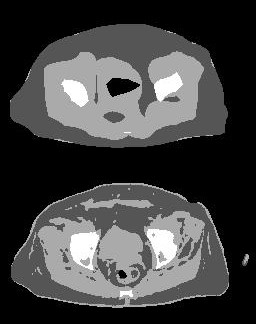

# deeplab-v3
Deeplab model version3 for medical image segmentation. 

A typical result would be:

Where the top one is the output and the bottom is the target.

It seems that deeplab model is not quite good at complex boundary.
